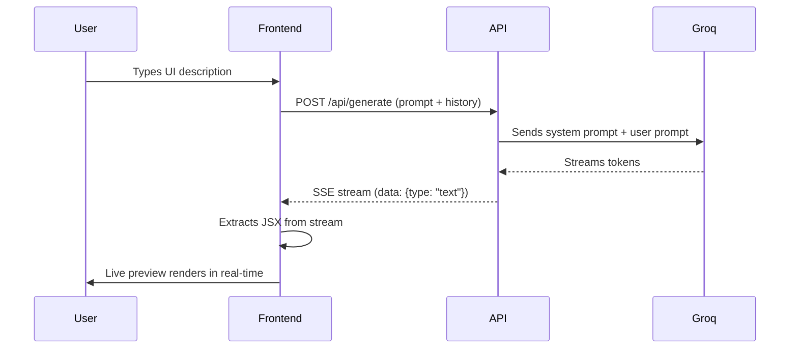

<div align="center">

<!-- Animated Banner -->


<!-- Badges Row 1 -->
<p>
  
  
  
  
</p>

<!-- Badges Row 2 -->
<p>
  
  
  
  
</p>

<br/>

> ### ✦ Describe any UI in plain English → get production-ready React + Tailwind code with a **live preview** — instantly.

<br/>

</div>

---

## 🎬 Demo

<div align="center">

| Chat & Prompt | Live Preview | Code View |
|:---:|:---:|:---:|
| Describe your UI in natural language | See it rendered live in real-time | Copy clean, production-ready JSX |

</div>

---

## ⚡ Features

<table>
<tr>
<td width="50%">

### 🧠 AI Generation
Powered by **Llama 3.3 70B** via Groq — one of the fastest inference engines available. Generates clean, idiomatic React + Tailwind JSX from a single sentence.

</td>
<td width="50%">

### 👁️ Live Preview
Components render **instantly** inside a sandboxed `react-live` panel. No build step. No page reload. What you describe is what you see.

</td>
</tr>
<tr>
<td width="50%">

### 💬 Multi-Turn Chat
Full **conversation history** is preserved across turns. Iterate and refine your component with follow-up messages like *"make the button blue"* or *"add a dark mode toggle"*.

</td>
<td width="50%">

### 🔌 Multi-Provider Fallback
Automatic provider cascading:
```
Cursor SDK → Groq (Llama 3.3) → OpenAI
```
If one fails, the next kicks in seamlessly.

</td>
</tr>
<tr>
<td width="50%">

### ⚡ Token Streaming
Responses stream token-by-token via **Server-Sent Events (SSE)** — no waiting for the full response before seeing output.

</td>
<td width="50%">

### 📋 One-Click Copy
Instantly copy the generated component code to your clipboard and drop it into your own project.

</td>
</tr>
</table>

---

## 🛠️ Tech Stack

<div align="center">

| Category | Technology | Purpose |
|:---:|:---:|:---:|
| **Framework** | Next.js 16 (App Router) | Server + Client rendering |
| **Language** | TypeScript 5 | Type-safe codebase |
| **Styling** | Tailwind CSS v4 | Utility-first CSS |
| **AI Model** | Llama 3.3 70B (Groq) | Component generation |
| **Streaming** | Server-Sent Events | Real-time token delivery |
| **Live Preview** | `react-live` | Sandboxed JSX renderer |
| **Icons** | `lucide-react` | Clean, consistent icons |
| **Deployment** | Vercel | Zero-config hosting |

</div>

---

## 🚀 Quick Start

### Prerequisites

- **Node.js** 18+
- A free **Groq API key** → [console.groq.com](https://console.groq.com)

### 1️⃣ Clone

```bash
git clone https://github.com/jd-thakrar/Cursor-event.git
cd Cursor-event
```

### 2️⃣ Install

```bash
npm install
```

### 3️⃣ Configure Environment

```bash
cp .env.local.example .env.local
```

Open `.env.local` and fill in your key:

```env
# ✅ Option 1 — Groq (Recommended · Free tier available)
GROQ_API_KEY=your_groq_api_key_here

# Option 2 — OpenAI
# OPENAI_API_KEY=your_openai_api_key_here

# Option 3 — Cursor SDK (requires Cursor Pro plan)
# CURSOR_API_KEY=your_cursor_api_key_here
```

> 💡 **Only one key is required.** Groq is recommended — it's free, fast, and has no rate limits for personal use.

### 4️⃣ Run

```bash
npm run dev
```

Open **[http://localhost:3000](http://localhost:3000)** 🎉

---

## 📁 Project Structure

```
📦 my-app
 ┣ 📂 app
 ┃ ┣ 📂 api
 ┃ ┃ ┗ 📂 generate
 ┃ ┃   ┗ 📜 route.ts          ← Streaming SSE API endpoint
 ┃ ┣ 📜 globals.css            ← Global styles
 ┃ ┣ 📜 layout.tsx             ← Root layout + metadata
 ┃ ┗ 📜 page.tsx               ← Entry page
 ┣ 📂 components
 ┃ ┣ 📜 ComponentBuilder.tsx   ← Main chat + preview shell
 ┃ ┗ 📜 LivePreview.tsx        ← react-live sandbox renderer
 ┣ 📂 lib
 ┃ ┣ 📜 generate.ts            ← Groq / OpenAI / Cursor SDK logic
 ┃ ┣ 📜 extract-code.ts        ← JSX parser from LLM output
 ┃ ┣ 📜 prompts.ts             ← System prompt engineering
 ┃ ┗ 📜 example-prompts.ts     ← Starter example prompts
 ┣ 📜 .env.local.example       ← Environment variable template
 ┣ 📜 .gitignore               ← Excludes .env, node_modules, .next
 ┣ 📜 LICENSE                  ← MIT License
 ┗ 📜 README.md
```

---

## 🔄 How It Works



---

## 💡 Example Prompts

<details>
<summary><b>🎨 UI Components</b></summary>

```
Build a SaaS pricing section with 3 tiers (Starter $9, Pro $29, Enterprise $99),
monthly/yearly toggle with 20% annual discount, feature lists with checkmarks,
and highlight the Pro tier with a gradient border.
```

```
Create a beautiful login form with email/password fields, a "Remember me" checkbox,
forgot password link, Google/GitHub social login buttons, and a smooth fade-in animation.
```
</details>

<details>
<summary><b>📊 Dashboards</b></summary>

```
Design a dark-themed admin dashboard with a collapsible sidebar, top navbar with
notification bell and avatar, 4 KPI stat cards, and a recent activity table.
```

```
Build an analytics overview page with a line chart for weekly revenue,
a donut chart for traffic sources, and a top-5 products table.
```
</details>

<details>
<summary><b>🃏 Cards & Lists</b></summary>

```
Make a team members grid with avatar, name, role, social links (Twitter, LinkedIn, GitHub),
and a hover card flip effect revealing their bio.
```

```
Create a Kanban board with To Do, In Progress, and Done columns.
Each card should have a title, tag badge, assignee avatar, and due date.
```
</details>

---

## 🌐 Deploy to Vercel

<div align="center">

[](https://vercel.com/new/clone?repository-url=https://github.com/jd-thakrar/Cursor-event)

</div>

1. Click the button above **or** go to [vercel.com](https://vercel.com) → **Add New Project**
2. Import the `Cursor-event` repository
3. Add your environment variables under **Settings → Environment Variables**:
   ```
   GROQ_API_KEY = your_key_here
   ```
4. Click **Deploy** ✅

Your app will be live at `your-project.vercel.app` in under 60 seconds.

---

## 🤝 Contributing

Contributions, issues and feature requests are welcome!

1. Fork the project
2. Create your branch: `git checkout -b feature/amazing-feature`
3. Commit your changes: `git commit -m 'Add amazing feature'`
4. Push to the branch: `git push origin feature/amazing-feature`
5. Open a **Pull Request**

---

## 📄 License

Distributed under the **MIT License**. See [`LICENSE`](./LICENSE) for more information.

---

<div align="center">


**Made with ❤️ by [Jeet Thakrar](https://github.com/jd-thakrar)**

⭐ **Star this repo if it helped you!** ⭐

</div>
